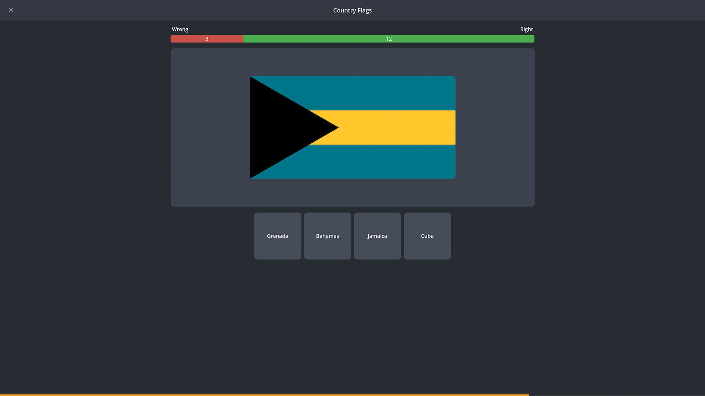

<h1 align="center">
  
    
  
  NimusCards
</h1>

***

A web-based flashcard app built with React. Users can create decks with different types of cards, practice with them, and see their learning progress.

[View project](https://andriuskv.github.io/nimus-cards)
